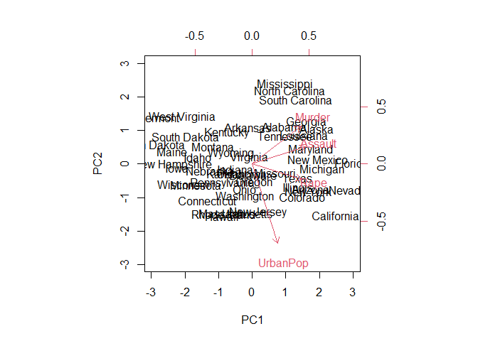
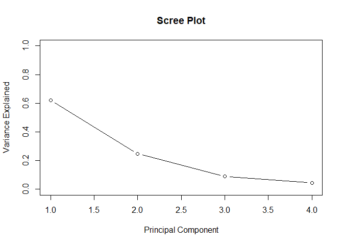

Principal Component Analysis of USArrests Dataset
================
Brandon Kim
10 August 2023

## What is the USArrests dataset?

The statistics of arrests per 100,000 residents for assault, murder, and
rape in each of the 50 US states in 1973. Also given is the percent of
the population living in urban areas.

    ##            Murder Assault UrbanPop Rape
    ## Alabama      13.2     236       58 21.2
    ## Alaska       10.0     263       48 44.5
    ## Arizona       8.1     294       80 31.0
    ## Arkansas      8.8     190       50 19.5
    ## California    9.0     276       91 40.6
    ## Colorado      7.9     204       78 38.7

The four factors of: Murder, Assault, Urban Population, and Rape will be
assessed in this PCA.

### PRComp

We use the function `prcomp()` to calculate the principal components of
the dataset. The function works by centering and scaling the each
variable to a normal distribution (mean = 0, sd = 1). A covariance
matrix is created with all of the variables (race, murders, etc.),
showing how variables are related to one another (strength and
direction).

Then R does some stuff with eigenvalues that I still can’t really wrap
my head around. Eigenvalues are a measure of how much a vector is
stretched in a transformation and I guess we are able to calculate that
in a PCA from the covariance matrix. These form the principal
components, with amount of variance being put in ascending order.

``` r
#calculate principal components
results <- prcomp(USArrests, scale = TRUE)
```

Specifying that `scale = TRUE` is critical as it ensures that the
variables are correctly scaled on a normal distribution

``` r
#reverse the signs
results$rotation <- -1*results$rotation

#display principal components
results$rotation
```

    ##                PC1        PC2        PC3         PC4
    ## Murder   0.5358995  0.4181809 -0.3412327 -0.64922780
    ## Assault  0.5831836  0.1879856 -0.2681484  0.74340748
    ## UrbanPop 0.2781909 -0.8728062 -0.3780158 -0.13387773
    ## Rape     0.5434321 -0.1673186  0.8177779 -0.08902432

The above code first flips the values of the eigenvalues with
`-1*results$rotation` so that the principal components can be better
interpreted.

The output, known as a eigenvalue matrix, shows the correlation between
the original variables and the Principal Components. We see that PC1 has
high values for Murder, Assault, and Rape, indicating that PC1 describes
the most variation in these variables.

Conversely, PC2 has by far the highest correlation in UrbanPop, meaning
that PC2 places heavy emphasis on Urban Population.

    ##                   PC1        PC2         PC3          PC4
    ## Alabama     0.9756604  1.1220012 -0.43980366 -0.154696581
    ## Alaska      1.9305379  1.0624269  2.01950027  0.434175454
    ## Arizona     1.7454429 -0.7384595  0.05423025  0.826264240
    ## Arkansas   -0.1399989  1.1085423  0.11342217  0.180973554
    ## California  2.4986128 -1.5274267  0.59254100  0.338559240
    ## Colorado    1.4993407 -0.9776297  1.08400162 -0.001450164

## Biplot of PC1 and PC2

After reversing the eigenvalues back to their original value,
`results$x` gives the principal component score for each observation for
every principal component. To better see this, we can create a biplot
that visualizes PC1 and PC2 and where all the states fit spatially on
this PC plot.

<!-- -->

We see that states that are close to each other will have similar data
patterns with one another. For instance, Vermont and West Virginia have
similar data patterns while also being in very close proximity:

    Vermont           2.2      48       32 11.2   
    West Virginia     5.7      81       39  9.3

Furthermore, the proximity of an observed point’s (a state’s) a variable
vector is proportional to their association. For instance, Georgia
appears to be closest to the Murder vector and if we take a look at the
states with the highest murder rates in the original dataset, we can see
that Georgia is actually at the top of the list:

    ##                Murder Assault UrbanPop Rape
    ## Georgia          17.4     211       60 25.8
    ## Mississippi      16.1     259       44 17.1
    ## Florida          15.4     335       80 31.9
    ## Louisiana        15.4     249       66 22.2
    ## South Carolina   14.4     279       48 22.5
    ## Alabama          13.2     236       58 21.2

## Scree Plot

We finish this by creating a scree plot, which is a graphic that
visualizes the amount of variation that each principal component is
responsible for. By doing so, we can see which principal components
contribute the most to the results of the dataset.

<!-- -->

## Summary of PC

By doing a summary of the `prcomp` of USArrests, we can see that PC1
accounts of around 62% of variation while PC2 captures around 25%. This
indicates that the first two principal components capture the majority
of the variability in the dataset. Given what we know about how PC1 is
explained by murder, assault, and rape and PC2 by UrbanPop, we can
create empirical assumptions about the data and its variability.

``` r
summary(results)
```

    ## Importance of components:
    ##                           PC1    PC2     PC3     PC4
    ## Standard deviation     1.5749 0.9949 0.59713 0.41645
    ## Proportion of Variance 0.6201 0.2474 0.08914 0.04336
    ## Cumulative Proportion  0.6201 0.8675 0.95664 1.00000

Because our summary shows that about 87% of the data’s variance can be
explained by the first two principal components, we are safe to assume
that the biplot of just PC1 and PC2 are valid representations of the
data.

## References

Zach. (2020, December 1). Principal components analysis in R:
Step-by-step example. Statology.
<https://www.statology.org/principal-components-analysis-in-r/>
