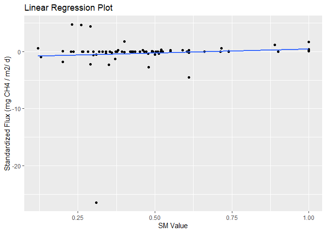
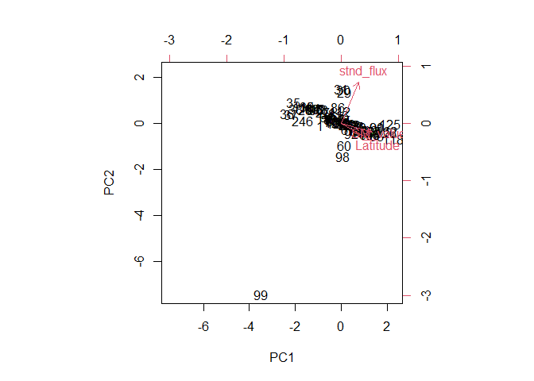
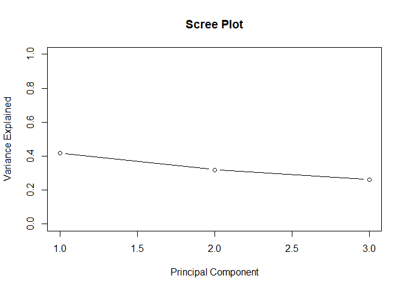

Initial Principal Component Analysis of Methane Data
================
Brandon Kim
10 August 2023

## What is the Methane dataset?

A dataset of 70+ existing research papers that contain available soil
methane (CH4) flux data

    ## Warning in system("DataDigester.R"): 'CreateProcess' failed to run
    ## 'C:\Users\kimb076\ONEDRI~1\DOCUME~1\GitHub\Methane\DATADI~1.R'

    ## [1] 127

    ##   Latitude SM_value stnd_flux
    ## 1    39.92    0.130  -0.95208
    ## 2    39.92    0.400  -0.06240
    ## 4    33.90    0.423  -0.00528
    ## 5    33.90    0.354  -0.00816
    ## 6    33.90    0.494  -0.00456
    ## 7    33.90    0.264  -0.03192

Latitude, Soil Moisture, Standardized CH4 Flux, Ecosystem type, and
Measurement period will be assessed in this PCA.

### Linear Regression

Doing a simple linear regression of CH4 soil flux and soil moisture
data, we can see a 2-variable comparison of the most obvious sources of
variance. However, we know that there is a multitude of factors that
contribute to soil methane flux. For this reason, we need a PCA to be
able to understand which factors contribute to this variance and to what
degree.

``` r
model <- lm(stnd_flux ~ SM_value, data = MethaneData)
summary(model)
```

    ## 
    ## Call:
    ## lm(formula = stnd_flux ~ SM_value, data = MethaneData)
    ## 
    ## Residuals:
    ##      Min       1Q   Median       3Q      Max 
    ## -25.9116  -0.0123   0.2818   0.4915   5.3744 
    ## 
    ## Coefficients:
    ##             Estimate Std. Error t value Pr(>|t|)
    ## (Intercept)  -0.9695     0.9091  -1.066    0.290
    ## SM_value      1.4048     1.7100   0.821    0.414
    ## 
    ## Residual standard error: 3.212 on 78 degrees of freedom
    ## Multiple R-squared:  0.008577,   Adjusted R-squared:  -0.004133 
    ## F-statistic: 0.6748 on 1 and 78 DF,  p-value: 0.4139

``` r
ggplot(MethaneData, aes(x = SM_value, y = stnd_flux)) +
  geom_point() +
  geom_smooth(method = "lm", se = FALSE) +
  labs(x = "SM Value", y = "Standardized Flux (mg CH4 / m2/ d)", title = "Linear Regression Plot")
```

    ## `geom_smooth()` using formula = 'y ~ x'

<!-- -->

### PRComp

We use the function `prcomp()` to calculate the principal components of
the dataset. The function works by centering and scaling the each
variable to a normal distribution (mean = 0, sd = 1). A covariance
matrix is created with all of the variables (race, murders, etc.),
showing how variables are related to one another (strength and
direction).

Then R does some stuff with eigenvalues that I still can’t really wrap
my head around. Eigenvalues are a measure of how much a vector is
stretched in a transformation and I guess we are able to calculate that
in a PCA from the covariance matrix. These form the principal
components, with amount of variance being put in ascending order.

``` r
#calculate principal components
results <- prcomp(MethaneData, scale = TRUE)
```

Specifying that `scale = TRUE` is critical as it ensures that the
variables are correctly scaled on a normal distribution

Because we are using categorical variables in this PCA (ecosystem type
and measurement period), we convert them into numerical values. It is
important to note that because these variables are not continuous, the
results of the PCA may be skewed.

``` r
#reverse the signs
results$rotation <- -1*results$rotation

#display principal components
results$rotation
```

    ##                 PC1        PC2        PC3
    ## Latitude  0.6390006 -0.3628852  0.6782275
    ## SM_value  0.6676388 -0.1762435 -0.7233233
    ## stnd_flux 0.3820165  0.9150151  0.1296566

The above code first flips the values of the eigenvalues with
`-1*results$rotation` so that the principal components can be better
interpreted.

The output, known as a eigenvalue matrix, shows the correlation between
the original variables and the Principal Components.

    ##           PC1         PC2       PC3
    ## 1 -0.91358934 -0.06132599 1.5159056
    ## 2  0.04533168 -0.03253307 0.6278518
    ## 4 -0.00544099  0.03855059 0.4132189
    ## 5 -0.22374775  0.09526663 0.6492453
    ## 6  0.21892616 -0.02044975 0.1702605
    ## 7 -0.51087945  0.16353447 0.9562967

## Biplot of PC1 and PC2

After reversing the eigenvalues back to their original value,
`results$x` gives the principal component score for each observation for
every principal component. To better see this, we can create a biplot
that visualizes PC1 and PC2 and where all the states fit spatially on
this PC plot.

<!-- -->

We see that states that are close to each other will have similar data
patterns with one another. Furthermore, the proximity of an observed
point’s (a state’s) a variable vector is proportional to their
association.

## Scree Plot

We finish this by creating a scree plot, which is a graphic that
visualizes the amount of variation that each principal component is
responsible for. By doing so, we can see which principal components
contribute the most to the results of the dataset.

<!-- -->

## Summary of PC

``` r
summary(results)
```

    ## Importance of components:
    ##                           PC1    PC2    PC3
    ## Standard deviation     1.1215 0.9795 0.8848
    ## Proportion of Variance 0.4192 0.3198 0.2610
    ## Cumulative Proportion  0.4192 0.7390 1.0000

## References

Zach. (2020, December 1). Principal components analysis in R:
Step-by-step example. Statology.
<https://www.statology.org/principal-components-analysis-in-r/>
